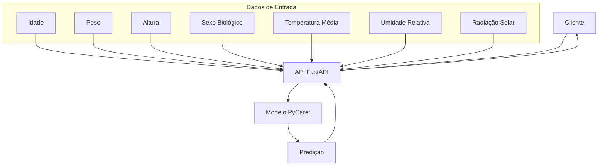
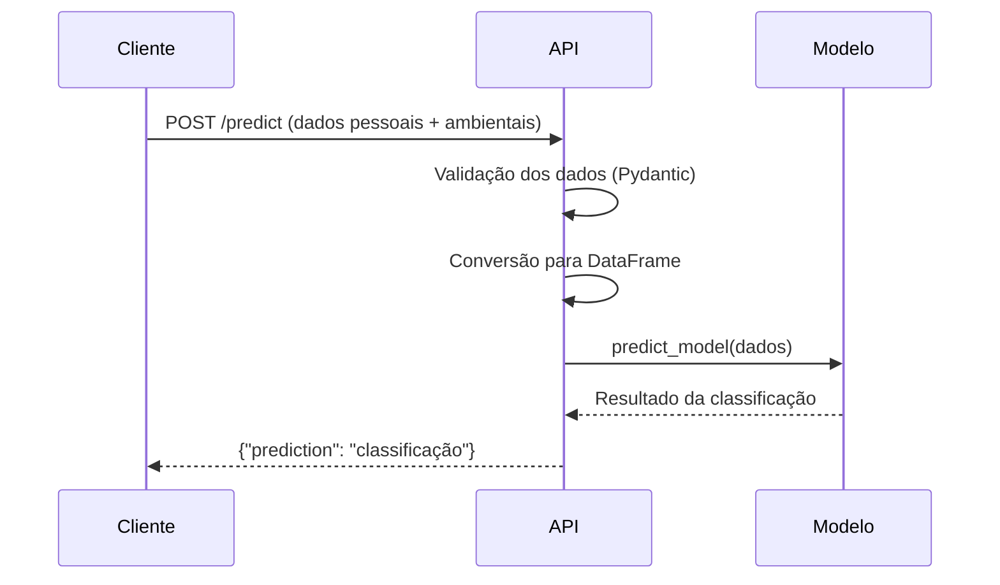
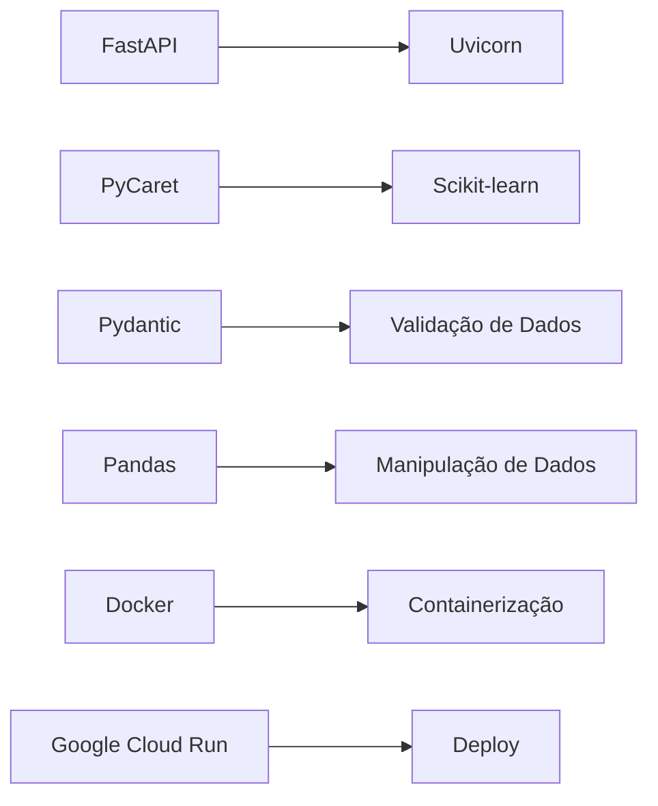

# API de Classificação de Conforto Térmico 🌡️

Esta API utiliza machine learning para classificar o conforto térmico de uma pessoa com base em características pessoais e condições ambientais.

## 🏗️ Arquitetura da Solução



## 📊 Fluxo de Predição



## 🚀 Como Implementar

### Pré-requisitos

- Docker instalado
- Google Cloud CLI (gcloud) configurado
- Conta no Google Cloud Platform

### 1. Build Local

```bash
# Navegar para a pasta da API
cd api

# Construir a imagem Docker
docker build -t conforto-api:conforto-termico .

# Testar localmente
docker run -p 8080:8080 conforto-api:conforto-termico
```

### 2. Deploy no Google Cloud Run

```bash
# Fazer tag da imagem para Google Container Registry
docker tag conforto-api:conforto-termico gcr.io/SEU-PROJECT-ID/conforto-api:latest

# Push para o registry
docker push gcr.io/SEU-PROJECT-ID/conforto-api:latest

# Deploy no Cloud Run
gcloud run deploy conforto-termico-api \
    --image gcr.io/SEU-PROJECT-ID/conforto-api:latest \
    --platform managed \
    --region us-central1 \
    --allow-unauthenticated \
    --port 8080
```

## 📋 Endpoints da API

### `GET /`
Endpoint de verificação básica da API.

**Resposta:**
```json
{
    "message": "Thermal Comfort API is running!"
}
```

### `GET /health`
Endpoint de verificação de saúde da aplicação.

**Resposta:**
```json
{
    "status": "healthy"
}
```

### `POST /predict`
Endpoint principal para classificação de conforto térmico.

**Body da Requisição:**
```json
{
    "idade_anos": 28,
    "peso_kg": 75.0,
    "altura_cm": 167,
    "sexo_biologico": "f",
    "temperatura_media_c": 29.8,
    "umidade_relativa_percent": 35.13,
    "radiacao_solar_media_wm2": 48.51
}
```

**Resposta:**
```json
{
    "prediction": "Quente"
}
```

## 🧪 Testando a API

### Teste Local

```bash
# Testar endpoint raiz
curl http://localhost:8080/

# Testar endpoint de saúde
curl http://localhost:8080/health

# Testar predição
curl -X POST "http://localhost:8080/predict" \
    -H "Content-Type: application/json" \
    -d '{
        "idade_anos": 28,
        "peso_kg": 75.0,
        "altura_cm": 167,
        "sexo_biologico": "f",
        "temperatura_media_c": 29.8,
        "umidade_relativa_percent": 35.13,
        "radiacao_solar_media_wm2": 48.51
    }'
```

### Teste no Cloud Run (PowerShell)

```powershell
# Testar predição no Cloud Run
Invoke-RestMethod -Uri "https://SEU-URL.run.app/predict" `
    -Method POST `
    -ContentType "application/json" `
    -Body '{
        "idade_anos": 28,
        "peso_kg": 75.0,
        "altura_cm": 167,
        "sexo_biologico": "f",
        "temperatura_media_c": 29.8,
        "umidade_relativa_percent": 35.13,
        "radiacao_solar_media_wm2": 48.51
    }'
```

## 🔧 Estrutura do Projeto

```
api/
├── Dockerfile          # Configuração do container
├── app.py              # Aplicação FastAPI principal
├── requirements.txt    # Dependências Python
├── api.pkl            # Modelo treinado do PyCaret
└── README.md          # Este arquivo
```

## 📊 Modelo de Dados

### Entrada (ThermalComfortInput)

| Campo | Tipo | Descrição | Exemplo |
|-------|------|-----------|---------|
| `idade_anos` | int | Idade em anos | 28 |
| `peso_kg` | float | Peso em quilogramas | 75.0 |
| `altura_cm` | int | Altura em centímetros | 167 |
| `sexo_biologico` | str | 'm' ou 'f' | 'f' |
| `temperatura_media_c` | float | Temperatura média em Celsius | 29.8 |
| `umidade_relativa_percent` | float | Umidade relativa em % | 35.13 |
| `radiacao_solar_media_wm2` | float | Radiação solar média em W/m² | 48.51 |

### Saída (ThermalComfortOutput)

| Campo | Tipo | Descrição | Possíveis Valores |
|-------|------|-----------|------------------|
| `prediction` | str | Classificação do conforto térmico | Quente, Frio, Confortável |

## 🛠️ Tecnologias Utilizadas



## ⚙️ Configurações do Dockerfile

- **Base Image:** `python:3.11-slim`
- **Porta:** 8080 (padrão do Cloud Run)
- **Servidor:** Uvicorn
- **Dependências de Sistema:** build-essential, gcc, g++, libgomp1

## 🔍 Troubleshooting

### Problema: Container não inicia no Cloud Run
**Solução:** Verificar se a porta 8080 está configurada corretamente

### Problema: Modelo não carrega
**Solução:** Certificar-se de que o arquivo `api.pkl` está presente

### Problema: Erro de dependências
**Solução:** Verificar se todas as dependências do `requirements.txt` estão corretas

## 📝 Logs e Monitoramento

Para visualizar logs no Cloud Run:

```bash
# Visualizar logs em tempo real
gcloud run logs tail conforto-termico-api --region=us-central1

# Visualizar logs específicos
gcloud run logs read conforto-termico-api --region=us-central1 --limit=50
```

## 🔒 Segurança

A API está configurada com `--allow-unauthenticated` para facilitar o uso. Para produção, considere:

- Implementar autenticação JWT
- Configurar CORS adequadamente
- Usar HTTPS sempre
- Implementar rate limiting

## 📈 Melhorias Futuras

- [ ] Implementar cache de predições
- [ ] Adicionar métricas de performance
- [ ] Implementar versionamento da API
- [ ] Adicionar documentação interativa (Swagger UI)
- [ ] Implementar batch predictions
- [ ] Adicionar testes automatizados