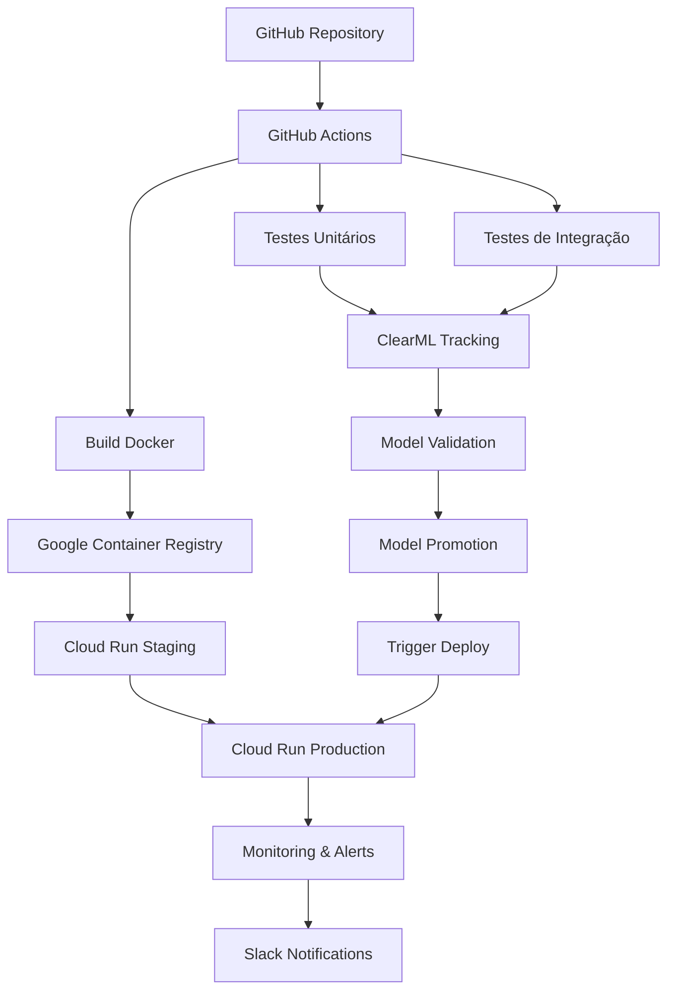
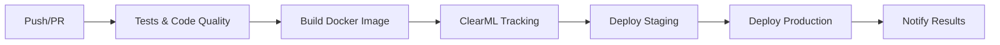
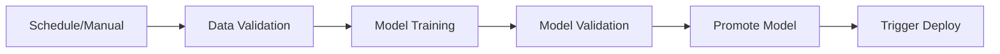

# 🚀 MLOps Pipeline - Documentação Completa

Este documento descreve o pipeline completo de MLOps implementado para o projeto de classificação de conforto térmico, incluindo testes automatizados, CI/CD, integração com ClearML e deploy no Google Cloud Platform.

## 📋 Índice

1. [Visão Geral da Arquitetura](#visão-geral-da-arquitetura)
2. [Estrutura de Testes](#estrutura-de-testes)
3. [Pipeline CI/CD](#pipeline-cicd)
4. [Integração com ClearML](#integração-com-clearml)
5. [Deploy Automatizado](#deploy-automatizado)
6. [Configuração do Ambiente](#configuração-do-ambiente)
7. [Monitoramento e Alertas](#monitoramento-e-alertas)
8. [Troubleshooting](#troubleshooting)

## 🏗️ Visão Geral da Arquitetura



## 🧪 Estrutura de Testes

### Organização dos Testes

```
tests/
├── __init__.py                 # Pacote de testes
├── conftest.py                # Fixtures compartilhadas
├── unit/                      # Testes unitários
│   ├── test_pipeline_utils.py # Testes para utils
│   └── test_processamento.py  # Testes para processamento
├── integration/               # Testes de integração
│   ├── test_api.py           # Testes da API
│   └── test_pipeline.py      # Testes do pipeline completo
└── load/                     # Testes de carga (futuro)
    └── test_performance.py
```

### Tipos de Testes Implementados

#### 1. **Testes Unitários** 🔬
- **Localização**: `tests/unit/`
- **Objetivo**: Testar funções individuais isoladamente
- **Cobertura**: Funções em `funcoes/pipeline_utils.py`
- **Tecnologias**: pytest, unittest.mock, pandas

**Exemplos de testes:**
- Validação de colunas de dados
- Resolução de nomes de colunas
- Processamento seguro com ClearML
- Criação de colunas de agrupamento temporal

#### 2. **Testes de Integração** 🔗
- **Localização**: `tests/integration/`
- **Objetivo**: Testar a API FastAPI como um todo
- **Cobertura**: Todos os endpoints da API
- **Tecnologias**: FastAPI TestClient, httpx

**Casos de teste cobertos:**
- Endpoints funcionais (`/`, `/health`, `/predict`)
- Validação de dados de entrada
- Tratamento de erros
- Performance e concorrência

#### 3. **Configurações de Teste** ⚙️
- **pytest.ini**: Configurações globais do pytest
- **conftest.py**: Fixtures compartilhadas entre testes
- **requirements-test.txt**: Dependências específicas para testes

### Como Executar os Testes

```bash
# Instalar dependências de teste
pip install -r requirements-test.txt

# Executar todos os testes
pytest

# Executar apenas testes unitários
pytest tests/unit/ -v

# Executar apenas testes de integração
pytest tests/integration/ -v

# Executar com cobertura
pytest --cov=funcoes --cov=api --cov-report=html

# Executar testes específicos
pytest tests/unit/test_pipeline_utils.py::TestEnsureGroupColumn::test_existing_mes_ano_column -v
```

## 🔄 Pipeline CI/CD

### Workflows Implementados

#### 1. **MLOps Pipeline** (`mlops-pipeline.yml`)



**Jobs do Pipeline Principal:**

1. **🧪 Tests & Code Quality**
   - Testes unitários e de integração
   - Análise de código com flake8
   - Verificação de segurança com bandit
   - Upload de cobertura para Codecov

2. **🏗️ Build & Push Docker Image**
   - Build da imagem Docker da API
   - Push para Google Container Registry
   - Versionamento automático

3. **📈 ClearML Model Tracking**
   - Atualização do registro de modelos
   - Tracking de experimentos
   - Versionamento de modelos

4. **🚀 Deploy Staging**
   - Deploy automático para ambiente de staging
   - Health check da aplicação
   - Configuração de recursos adequada

5. **🎯 Deploy Production**
   - Deploy para produção (apenas branch main)
   - Health check de produção
   - Criação de release no GitHub

6. **📢 Notify Deployment**
   - Notificações via Slack
   - Status de sucesso/falha
   - Links para os ambientes

#### 2. **Model Training Pipeline** (`model-training.yml`)



**Jobs do Pipeline de Treinamento:**

1. **🔍 Data Validation**
   - Validação de qualidade dos dados
   - Detecção de drift nos dados
   - Profiling automático dos dados

2. **🎯 Model Training**
   - Treinamento automático de modelos
   - Tracking de experimentos no ClearML
   - Salvamento de artefatos

3. **🧪 Model Validation**
   - Validação de performance do modelo
   - Comparação com modelos anteriores
   - Testes de regressão

4. **🚀 Promote Model**
   - Promoção de modelos aprovados
   - Versionamento no ClearML
   - Arquivamento de modelos antigos

5. **🔄 Trigger Deployment**
   - Disparo automático do pipeline de deploy
   - Integração entre pipelines

### Triggers dos Workflows

#### Pipeline Principal (mlops-pipeline.yml)
- **Push** para branches `main` e `develop`
- **Pull Requests** para `main`
- **Manual** via workflow_dispatch

#### Pipeline de Treinamento (model-training.yml)
- **Agendado** todo domingo às 2:00 UTC
- **Manual** via workflow_dispatch
- **Webhook** de dados atualizados (futuro)

## 🎯 Integração com ClearML

### Configuração do ClearML

O ClearML é usado para tracking de experimentos, versionamento de modelos e gestão de artefatos.

#### Secrets Necessários

Configure os seguintes secrets no GitHub:

```bash
CLEARML_WEB_HOST=https://app.clear.ml
CLEARML_API_HOST=https://api.clear.ml
CLEARML_FILES_HOST=https://files.clear.ml
CLEARML_ACCESS_KEY=your_access_key
CLEARML_SECRET_KEY=your_secret_key
```

#### Estrutura de Projetos no ClearML

```
conforto_termico/
├── data_validation/           # Tarefas de validação de dados
├── model_training/           # Experimentos de treinamento
├── model_validation/         # Validação de modelos
├── model_promotion/          # Promoção de modelos
└── deployment/              # Tracking de deploys
```

#### Tags de Modelos

- `training`: Modelo em treinamento
- `validated`: Modelo validado
- `production`: Modelo em produção
- `archived`: Modelo arquivado
- `deployed-{sha}`: Deploy específico

### Funcionalidades Implementadas

1. **Tracking Automático**
   - Métricas de treinamento
   - Hiperparâmetros
   - Artefatos (modelos, dados, gráficos)

2. **Versionamento de Modelos**
   - Controle de versão automático
   - Comparação entre modelos
   - Rollback automático se necessário

3. **Gestão de Experimentos**
   - Organização por projetos
   - Tags para facilitar busca
   - Histórico completo

## 🌐 Deploy Automatizado

### Ambientes de Deploy

#### 1. **Staging Environment**
- **URL**: Gerada automaticamente pelo Cloud Run
- **Recursos**: 1 CPU, 1GB RAM
- **Scaling**: 0-10 instâncias
- **Trigger**: Todo push/PR

#### 2. **Production Environment**
- **URL**: Fixa (configurada no DNS)
- **Recursos**: 2 CPU, 2GB RAM  
- **Scaling**: 1-50 instâncias
- **Trigger**: Apenas push para main

### Configuração do Google Cloud

#### Secrets do GCP Necessários

```bash
GCP_PROJECT_ID=your-project-id
GCP_SA_KEY=your-service-account-key-json
```

#### Serviços Utilizados

1. **Google Container Registry (GCR)**
   - Armazenamento de imagens Docker
   - Versionamento automático
   - Integração com Cloud Run

2. **Google Cloud Run**
   - Deploy serverless da API
   - Scaling automático
   - HTTPS automático

3. **Google Cloud Build** (opcional)
   - Build remoto de imagens
   - Cache de layers

### Health Checks

```bash
# Health check implementado
curl https://your-api-url/health

# Response esperado
{
    "status": "healthy"
}
```

## ⚙️ Configuração do Ambiente

### 1. Configuração do Repositório GitHub

#### Secrets Obrigatórios

```bash
# Google Cloud Platform
GCP_PROJECT_ID=streamlit-388123
GCP_SA_KEY={"type": "service_account", ...}

# ClearML
CLEARML_WEB_HOST=https://app.clear.ml
CLEARML_API_HOST=https://api.clear.ml
CLEARML_FILES_HOST=https://files.clear.ml
CLEARML_ACCESS_KEY=your_access_key
CLEARML_SECRET_KEY=your_secret_key

# Notificações (opcional)
SLACK_WEBHOOK_URL=https://hooks.slack.com/...
```

#### Variáveis de Ambiente

```yaml
# No workflow
env:
  PROJECT_ID: ${{ secrets.GCP_PROJECT_ID }}
  GAR_LOCATION: us-central1
  SERVICE: conforto-termico-api
  REGION: us-central1
  PYTHON_VERSION: '3.11'
```

### 2. Configuração do Google Cloud

#### Habilitar APIs

```bash
gcloud services enable run.googleapis.com
gcloud services enable containerregistry.googleapis.com
gcloud services enable cloudbuild.googleapis.com
```

#### Criar Service Account

```bash
# Criar service account
gcloud iam service-accounts create github-actions \
    --display-name="GitHub Actions"

# Conceder permissões
gcloud projects add-iam-policy-binding $PROJECT_ID \
    --member="serviceAccount:github-actions@$PROJECT_ID.iam.gserviceaccount.com" \
    --role="roles/run.admin"

gcloud projects add-iam-policy-binding $PROJECT_ID \
    --member="serviceAccount:github-actions@$PROJECT_ID.iam.gserviceaccount.com" \
    --role="roles/storage.admin"

# Criar chave JSON
gcloud iam service-accounts keys create key.json \
    --iam-account=github-actions@$PROJECT_ID.iam.gserviceaccount.com
```

### 3. Configuração do ClearML

#### Instalação Local

```bash
pip install clearml
clearml-init
```

#### Configuração no CI/CD

A configuração é feita automaticamente via secrets nos workflows.

## 📊 Monitoramento e Alertas

### Métricas Monitoradas

1. **API Performance**
   - Response time
   - Error rate
   - Throughput

2. **Model Performance**
   - Prediction accuracy
   - Drift detection
   - Model degradation

3. **Infrastructure**
   - CPU/Memory usage
   - Instance scaling
   - Error logs

### Alertas Configurados

#### Slack Notifications

1. **Deploy Success/Failure**
2. **Model Training Results**
3. **Performance Degradation**
4. **Infrastructure Issues**

#### Exemplo de Configuração de Alerta

```yaml
- name: 📬 Notify Slack (Success)
  if: needs.deploy-production.result == 'success'
  uses: 8398a7/action-slack@v3
  with:
    status: success
    text: |
      🎉 *Deployment Successful!*
      
      *Production:* ${{ needs.deploy-production.outputs.url }}
      *Staging:* ${{ needs.deploy-staging.outputs.url }}
```

## 🔧 Troubleshooting

### Problemas Comuns

#### 1. Falha nos Testes

**Sintoma**: Pipeline falha no job de testes
**Possíveis Causas**:
- Imports incorretos
- Dependências faltando
- Dados de teste inválidos

**Solução**:
```bash
# Rodar testes localmente
pytest tests/ -v --tb=long

# Verificar imports
python -c "from funcoes.pipeline_utils import ensure_group_column"

# Instalar dependências
pip install -r requirements-test.txt
```

#### 2. Falha no Build Docker

**Sintoma**: Job de build falha
**Possíveis Causas**:
- Dockerfile incorreto
- Arquivo não encontrado
- Permissões do registry

**Solução**:
```bash
# Testar build local
cd api
docker build -t test-image .

# Verificar arquivos
ls -la api/

# Testar push manual
docker tag test-image gcr.io/$PROJECT_ID/test
docker push gcr.io/$PROJECT_ID/test
```

#### 3. Falha no Deploy

**Sintoma**: Job de deploy falha
**Possíveis Causas**:
- Permissões insuficientes
- Imagem não encontrada
- Configuração incorreta

**Solução**:
```bash
# Verificar permissões
gcloud auth list
gcloud projects get-iam-policy $PROJECT_ID

# Deploy manual
gcloud run deploy test-service \
  --image=gcr.io/$PROJECT_ID/image:tag \
  --region=us-central1 \
  --platform=managed
```

#### 4. Falha na Integração ClearML

**Sintoma**: Tracking não funciona
**Possíveis Causas**:
- Credenciais incorretas
- Servidor indisponível
- Configuração incorreta

**Solução**:
```bash
# Testar conexão
clearml-init

# Verificar credenciais
python -c "from clearml import Task; print('ClearML OK')"

# Debug
export CLEARML_LOG_LEVEL=DEBUG
```

### Logs e Debugging

#### Visualizar Logs do GitHub Actions

1. Acesse a aba "Actions" no GitHub
2. Selecione o workflow executado
3. Clique no job que falhou
4. Expanda os steps para ver logs detalhados

#### Visualizar Logs do Cloud Run

```bash
# Logs em tempo real
gcloud run logs tail $SERVICE_NAME --region=$REGION

# Logs específicos
gcloud run logs read $SERVICE_NAME --region=$REGION --limit=100
```

#### Visualizar Logs do ClearML

1. Acesse o ClearML Web UI
2. Navegue até o projeto
3. Selecione o experimento/task
4. Verifique a aba "Console" para logs

## 📈 Melhorias Futuras

### Roadmap de Desenvolvimento

1. **Testes de Carga** 🚀
   - Implementar testes de performance
   - Benchmark da API
   - Stress testing

2. **Monitoring Avançado** 📊
   - Integration com Prometheus/Grafana
   - Alertas personalizados
   - Dashboards de performance

3. **Security** 🔒
   - Scan de vulnerabilidades
   - Compliance checks
   - Secrets rotation

4. **Multi-Environment** 🌍
   - Ambiente de desenvolvimento
   - Feature branches deployment
   - Blue/Green deployment

5. **Advanced ML** 🤖
   - A/B testing de modelos
   - Automatic retraining
   - Model performance monitoring

## 🎯 Conclusão

Este pipeline MLOps oferece uma solução completa e automatizada para:

- ✅ **Qualidade de Código**: Testes automatizados e análise contínua
- ✅ **CI/CD Robusto**: Deploy automatizado com multiple ambientes  
- ✅ **ML Lifecycle**: Tracking, validação e promoção de modelos
- ✅ **Monitoramento**: Alertas e notificações em tempo real
- ✅ **Escalabilidade**: Infraestrutura cloud-native

O pipeline garante que cada mudança no código seja testada, validada e deployada de forma segura e consistente, seguindo as melhores práticas de MLOps e DevOps.

---

**Documentação mantida por**: Equipe MLOps  
**Última atualização**: $(date)  
**Versão**: 1.0